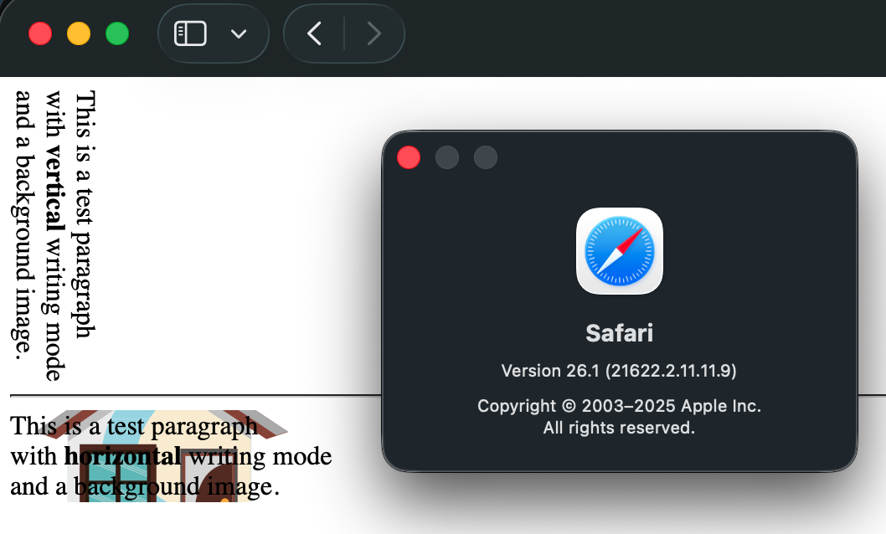
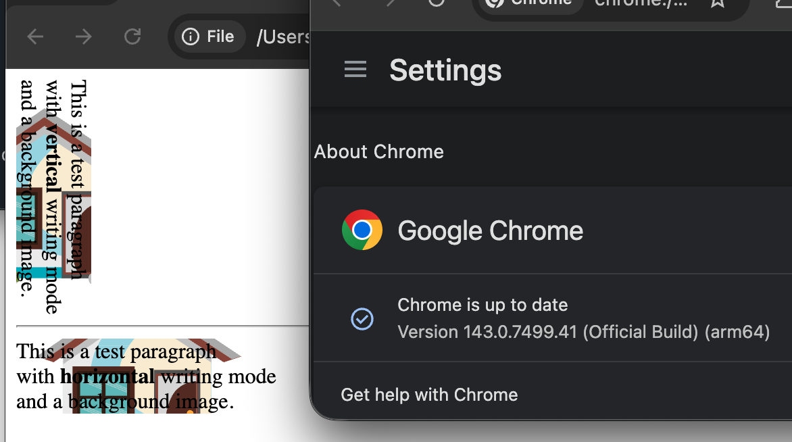

# Safari Issue: Background Image in Vertical Writing Mode

This repository demonstrates an issue with Safari when background image isn't shown when a child element is set to vertical writing mode.

Reported here: https://bugs.webkit.org/show_bug.cgi?id=303742

See [deployed](https://maxim-mazurok.github.io/safari-issue-background-image-vertical-writing-mode/) page or [index.html](./index.html) for the code.

## Images

Background image is missing in Safari:

Background image is shown correctly in Chrome:

## Workaround

Workaround is to move the `writing-mode: vertical-rl;` from the child element to the parent element, see [workaround.html](./workaround.html) or [deployed page](https://maxim-mazurok.github.io/safari-issue-background-image-vertical-writing-mode/workaround.html).

<!-- TODO: make this file shorter -->